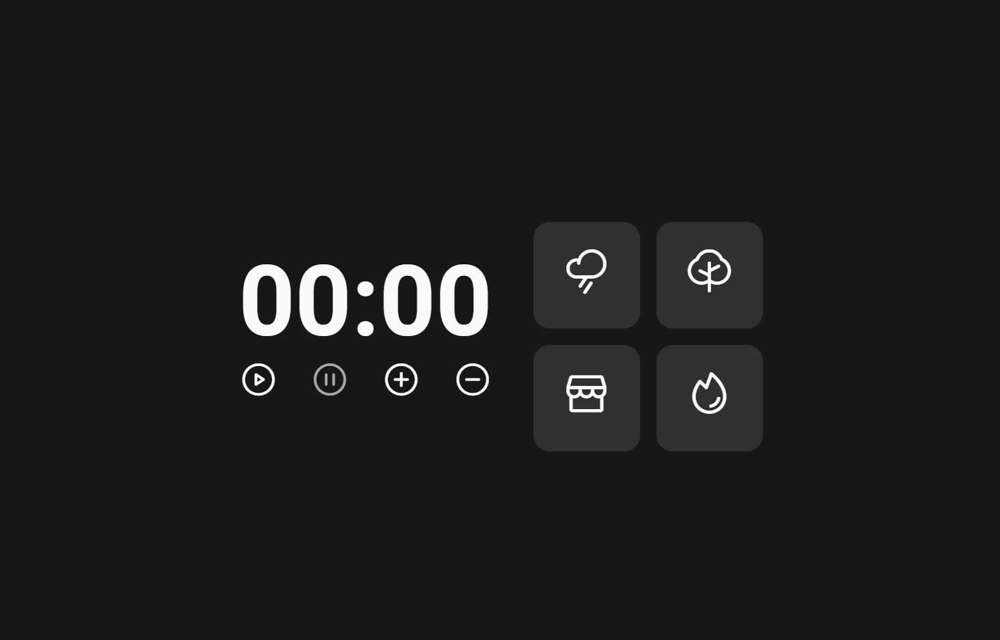

<h1 align="center"> Focus timer 2.0 </h1>

  

 

  

## 🚀 Tecnologias

Esse projeto foi desenvolvido com as seguintes tecnologias:

- HTML e CSS
- JavaScript

## 💻 Projeto

Nesse projeto utilizei javaScript puro para fazer um timer para ajudar a utilizar a técnica de pomodo, o projeto possui sons ambiente para ajudar a relaxar e manter o foco, também possui controle de volume e um dark/light mode automático.

 <h3 align="center"> Developed by <a href="https://www.linkedin.com/in/gabriel-santos-bb4a10188/">Gabriel Santos</a> ☕</h3>
